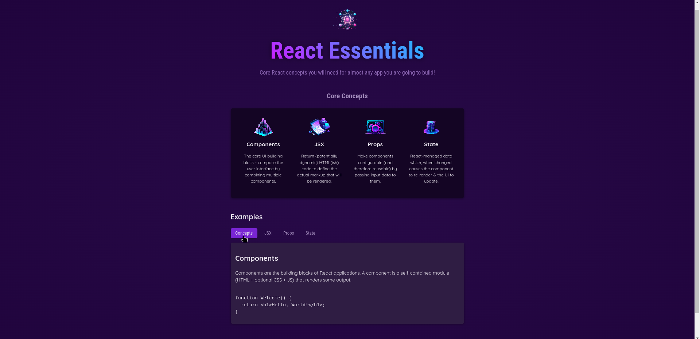
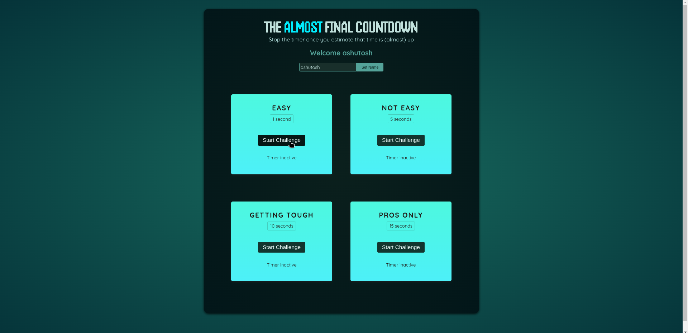
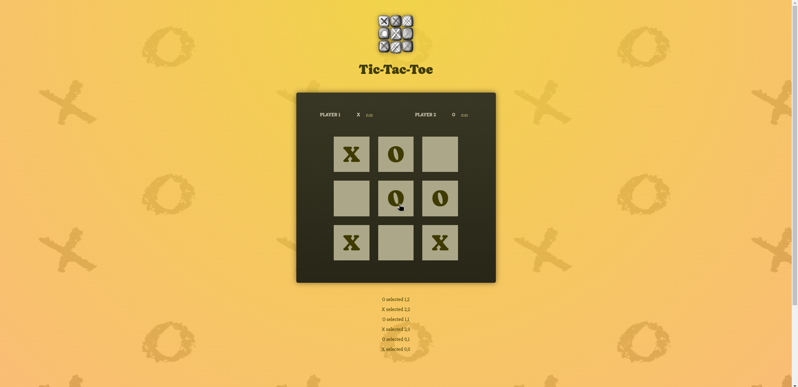
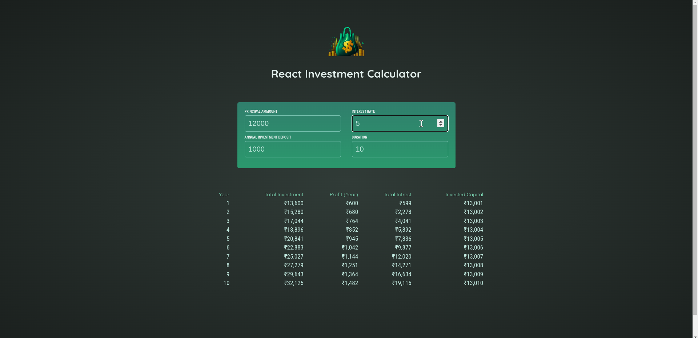
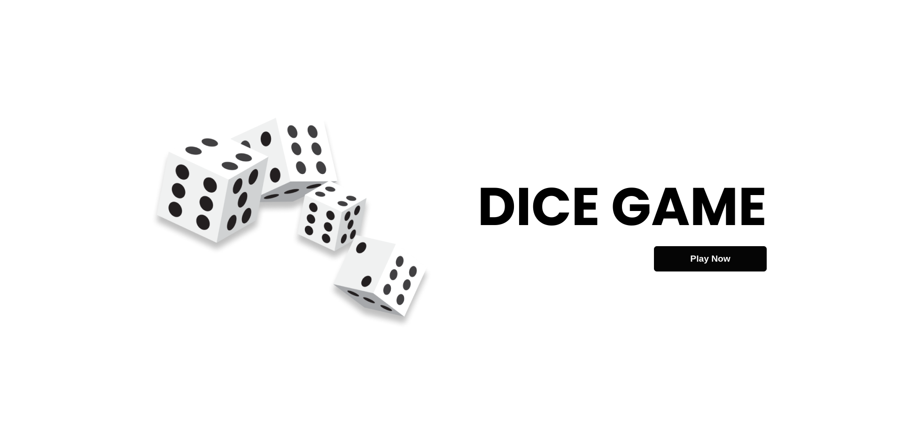
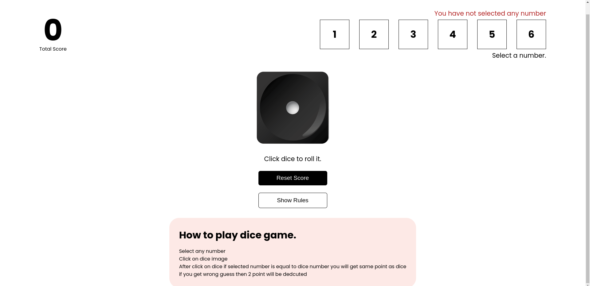
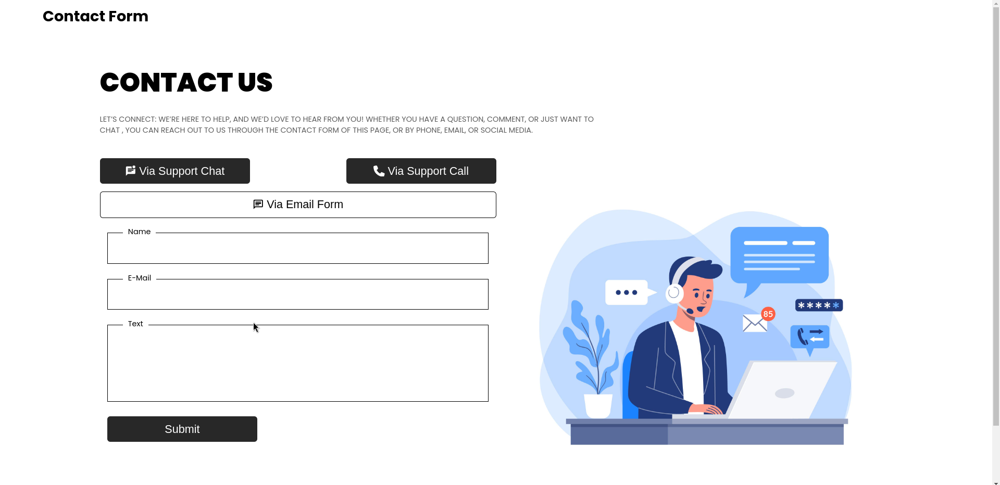
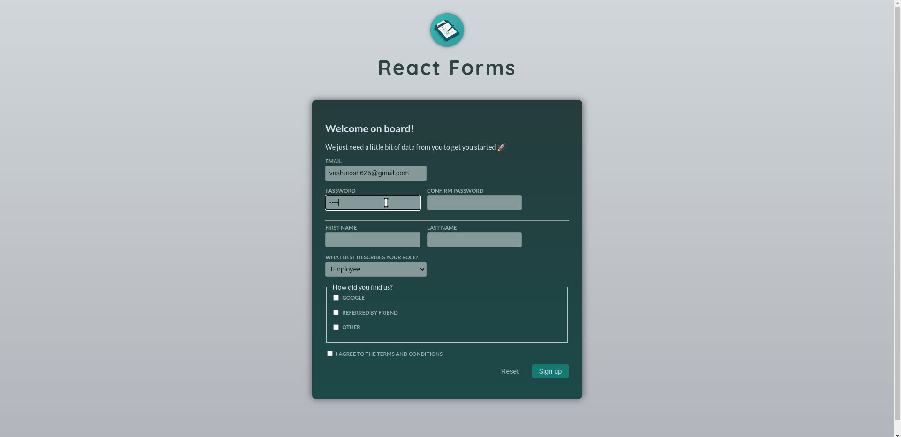

# Mini React Projects

I created these mini react projects while I was learning core and advance react concepts.

    
 
## 01-Beginners Project

### Concepts Learned

- JSX
- React components
- Import, export of components
- Props
- Conditional rendering

## 02-Stop the timer game

### Concepts Learned

- useState Hook
- useRef Hook
- setTimeout() function
- setInterval() function
- Lifting state up

## 03-Tic tac toe game

### Concepts Used

- useState
- list rendering and keys
- event Handling
- Changing state based on the previous state
- modifing objects and arrays based on previous data

## 04- Investment Calculator

### Concepts Used

- Two way binding
- Input handling

## 05- Dice game

### Concepts Used

- react-router-dom
- context api
- useContext, createContext

## 06- Contact Form

### Concepts Used

- Creating forms
- validating form data
- useRefs

## 07- Forms

### Concepts Used

- Getting form data of various input types

